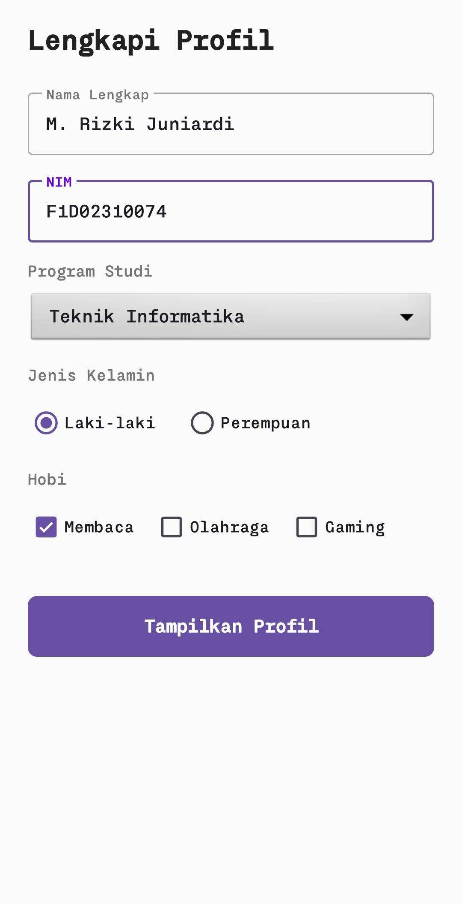
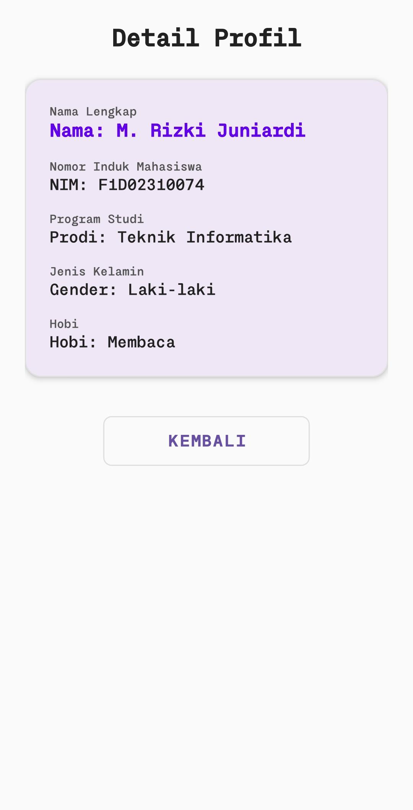

# 📱 ProfileApp - Aplikasi Registrasi & Profil Mahasiswa

## 🧾 Deskripsi

**ProfileApp** adalah aplikasi Android sederhana yang dikembangkan menggunakan bahasa **Kotlin**. Aplikasi ini bertujuan untuk mengimplementasikan konsep dasar dalam pengembangan aplikasi mobile, yaitu:

* Activities
* Intent (navigasi antar halaman)
* Desain UI berbasis XML
* Pengiriman data menggunakan Parcelable

Pengguna dapat mengisi data diri pada halaman registrasi, kemudian melihat hasil input tersebut pada halaman profil.

---

## 🚀 Fitur Utama

### 📝 Halaman Registrasi

* Input Nama Lengkap
* Input NIM 
* Pilihan Program Studi (Spinner)
* Pilihan Jenis Kelamin (Radio Button)
* Pilihan Hobi (Checkbox)
* Tombol untuk menampilkan profil

### 🪪 Halaman Profil

* Menampilkan data yang telah diinput
* Tampilan sederhana dan informatif
* Tombol kembali ke halaman sebelumnya

---

## 🛠️ Teknologi yang Digunakan

* **Bahasa Pemrograman**: Kotlin
* **IDE**: Android Studio
* **UI Design**: XML Layout
* **Data Transfer**: Parcelable (Manual Implementation)
* **Komponen Android**:

  * Activity
  * Intent
  * View (EditText, Spinner, RadioButton, CheckBox, Button, TextView)

---

## 🔄 Alur Aplikasi

1. Pengguna mengisi form pada halaman registrasi
2. Sistem melakukan validasi input
3. Data dikemas dalam objek `User`
4. Data dikirim ke halaman profil menggunakan Intent
5. Halaman profil menampilkan data pengguna

---

## 📁 Struktur Project

```
com.example.profileapp
├── model
│   └── User.kt
├── ui
│   ├── MainActivity.kt
│   └── ProfileActivity.kt
├── res
│   ├── layout
│   │   ├── activity_main.xml
│   │   └── activity_profile.xml
```

---

## ⚙️ Cara Menjalankan Aplikasi

1. Clone repository ini:

   ```bash
   git clone https://github.com/Ardihh/profileApp.git
   ```

2. Buka project di Android Studio

3. Tunggu proses Gradle selesai

4. Jalankan aplikasi di:

   * Emulator ATAU
   * Perangkat Android

---

## 📸 Screenshot Aplikasi

1. Tampilan input data


2. Tampilan profile


---

## 📌 Catatan

* Aplikasi ini menggunakan **Parcelable manual** untuk menghindari ketergantungan plugin tambahan
* Validasi input dilakukan untuk memastikan data tidak kosong
* Desain UI dibuat sederhana namun tetap user-friendly

---

## 👨‍💻 Pengembang

* Nama: M. RIZKI JUNIARDI
* NIM: F1D02310074

---

## 🎯 Tujuan Pembelajaran

Aplikasi ini dibuat untuk memenuhi tugas mata kuliah **Mobile Programming** dengan tujuan memahami:

* Implementasi Activity
* Penggunaan Intent eksplisit
* Desain UI berbasis XML
* Pengiriman data antar Activity menggunakan Parcelable

---

## ⭐ Penutup

Aplikasi ini merupakan implementasi sederhana namun fundamental dalam pengembangan aplikasi Android. Diharapkan dapat menjadi dasar untuk pengembangan aplikasi yang lebih kompleks di masa depan.

---
